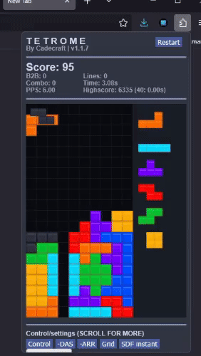
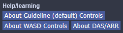
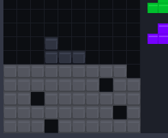
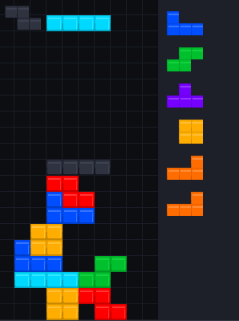

# Tetrome
The best advanced stacker popup game for your browser! Control/handling options, T-spins, hold, kicks, bag generation, advanced stats, and more.

## Installation

If you need help installing Tetrome in Chrome, please check this doc: <https://docs.google.com/document/d/1JQmokOOMqgV5BFe61xBBSkH7UI06-6SHG1IeSalpvKo/edit>

An official release isn't available for Firefox yet, but you can install Tetrome as a [temporary addon](https://extensionworkshop.com/documentation/develop/temporary-installation-in-firefox/) if you want to try out the game.

See more info on my website, <https://cadecraft.github.io/>.

## Controls

For more help with controls and gameplay, scroll down in-game to see a help menu:

### Guideline controls (default)
- Rotate: `X`/`Z`/`A`
- Move: `Left arrow`/`Right arrow`
- Hard drop: `Space`
- Soft drop: `Down arrow`
- Hold: `C`/`Shift`
- Restart: `R`

### WASD controls
- Rotate: `Left arrow`/`Right arrow`/`Up arrow`
- Move: `A`/`D`
- Hard drop: `S`/`Space`
- Soft drop: `W`
- Hold: `Shift`
- Restart: `R`

### Handling
The DAS, ARR, and SDF settings determine how quickly the piece responds to your input. They are stored as delays in milliseconds, meaning the lower their value, the faster the game will appear to respond. If you're experienced, you probably want to adjust these using the in-game settings.
- DAS: [Delayed Auto Shift](https://tetris.wiki/DAS) is the delay before a piece starts automatically moving while you hold down left or right
- ARR: Auto Repeat Rate is the speed at which it moves while holding down left or right
- SDF: Soft Drop Factor is the speed at which a piece falls while you're soft-dropping it

## Other fun features
To practice downstacking and garbage clearing, use the **Cheese Timer** to automatically generate garbage pieces on an interval.

If you want to practice your recovery skills, press the **Recovery Challenge** button in-game to fill your screen with a bunch of randomly-placed pieces!

## Development

It's been a while since I last worked on this project (so the code quality isn't as good as my more recent work), but feel free to contribute or submit issues if you come across anything. I'm hoping to get Tetrome on the Chrome Web Store and Firefox Add-ons one day, too.
